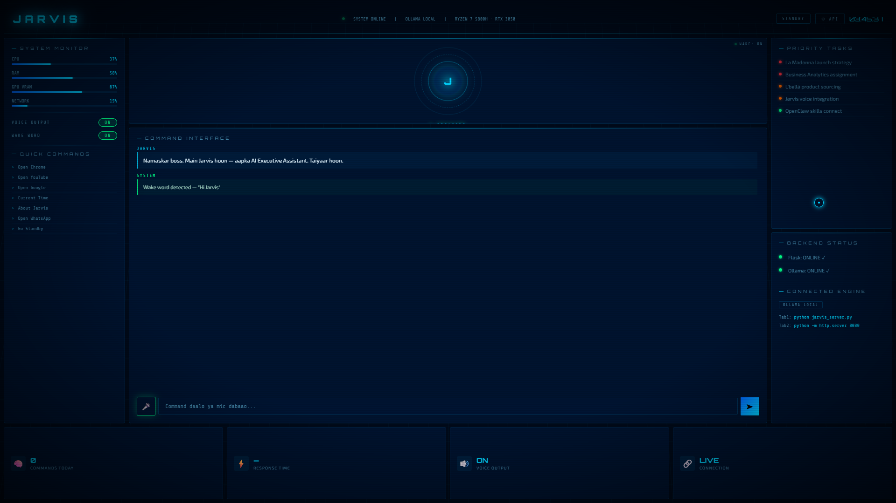

<div align="center">

# 🤖 JARVIS — AI Executive Assistant

### *Your Personal Iron Man-Style AI Operating System*

[](LICENSE)
[](https://python.org)
[](https://ollama.com)
[](https://aistudio.google.com)
[](https://github.com/yourusername/jarvis-ai-assistant)



**A cinematic, futuristic AI assistant with voice control, wake word detection, and a stunning Iron Man-style dashboard.**

[Features](#-features) • [Quick Start](#-quick-start) • [Screenshots](#-screenshots) • [Architecture](#-architecture) • [API Setup](#-api-setup) • [Contributing](#-contributing)

---

</div>

## ⚡ What is this?

Jarvis is a **real, working AI assistant** with:
- 🎬 **Cinematic boot sequence** — feels like booting up an AI operating system
- 🎤 **Voice commands** — say "Hi Jarvis" to wake, speak your commands
- 🧠 **Multi-AI support** — Ollama (local/free), Gemini (free API), GPT-4, Claude
- 🖥️ **Stunning dashboard** — Iron Man-inspired dark UI with live system stats
- 🚀 **App control** — open Chrome, YouTube, WhatsApp by voice or click
- 💤 **Standby mode** — sleeps until you call, just like the real Jarvis

> **This is not just a chatbot. This is an AI operating system.**

---

## 🎯 Features

### 🎬 Cinematic Boot Sequence
Real-time system initialization with hardware detection, model loading, and status checks.

### 🎤 Wake Word Detection
Say **"Hi Jarvis"** or **"Hey Jarvis"** — the system wakes up with a flash animation and starts listening.

### 🧠 Multi-AI Engine Support
| Engine | Cost | Speed | Quality |
|--------|------|-------|---------|
| Ollama (Local) | Free | Fast | Good |
| Google Gemini | Free | Fast | Excellent |
| OpenAI GPT-4 | Paid | Medium | Excellent |
| Claude | Paid | Medium | Excellent |

### 🖥️ Iron Man Dashboard
- Animated AI core with rotating rings
- Live CPU/RAM/GPU/Network monitoring
- Command history with timestamps
- Priority task panel
- Backend status indicators
- Voice output with speaking animation
- Custom cursor with glow effect

### 🔊 Voice I/O
- **Input**: Browser Speech Recognition (Chrome)
- **Output**: Text-to-Speech with premium male voice
- **Wake Word**: Always-listening background detection

### ⚡ App Control
- Open Chrome, YouTube, Google, WhatsApp
- Get current time and date
- Extensible command system

---

## 🚀 Quick Start

### Prerequisites
- **Python 3.11+**
- **Git Bash** (Windows) or Terminal (Mac/Linux)
- **Chrome** (for voice features)
- **Ollama** (optional, for local AI) — [Download](https://ollama.com)

### 1. Clone the repo
```bash
git clone https://github.com/yourusername/jarvis-ai-assistant.git
cd jarvis-ai-assistant
```

### 2. Install dependencies
```bash
pip install flask flask-cors requests pyttsx3 SpeechRecognition pyaudio
```

### 3. Start the server
```bash
cd backend
python server.py
```

### 4. Start the dashboard
```bash
cd frontend
python -m http.server 8080
```

### 5. Open in Chrome
```
http://localhost:8080
```

### 6. Say "Hi Jarvis" 🎤

---

## 🔑 API Setup

### Ollama (Free, Local)
```bash
# Install Ollama
curl -fsSL https://ollama.com/install.sh | sh

# Pull a model
ollama pull qwen2.5:1.5b

# Start server
ollama serve
```

### Google Gemini (Free API)
1. Go to [Google AI Studio](https://aistudio.google.com/apikey)
2. Click **"Create API Key"**
3. Add key to `backend/server.py`:
```python
GEMINI_KEY = "your-api-key-here"
```

### OpenAI / Claude
Add your API key in the dashboard settings (⚙ button).

---

## 📁 Project Structure

```
jarvis-ai-assistant/
├── frontend/
│   └── index.html          # Cinematic Jarvis dashboard
├── backend/
│   ├── server.py           # Flask API server (Gemini + Ollama)
│   └── voice_assistant.py  # Standalone voice assistant
├── scripts/
│   ├── start.bat           # Windows one-click launcher
│   └── start.sh            # Mac/Linux one-click launcher
├── docs/
│   ├── SETUP.md            # Detailed setup guide
│   └── API.md              # API documentation
├── assets/
│   └── jarvis-preview.png  # Dashboard screenshot
├── requirements.txt
├── LICENSE
└── README.md
```

---

## 🏗️ Architecture

```
┌──────────────────┐     ┌──────────────────┐     ┌──────────────────┐
│                  │     │                  │     │                  │
│   Dashboard UI   │────▶│  Flask Backend   │────▶│    AI Engine     │
│   (HTML/JS)      │◀────│  (Python)        │◀────│  Gemini/Ollama   │
│                  │     │                  │     │                  │
└──────────────────┘     └──────────────────┘     └──────────────────┘
        │                        │
        ▼                        ▼
  Voice I/O              App Automation
  (Web Speech API)       (os/webbrowser)
```

---

## 🗺️ Roadmap

- [x] Voice assistant with wake word
- [x] Ollama local AI integration
- [x] Cinematic dashboard UI
- [x] Gemini API integration
- [x] Multi-AI engine switching
- [x] App control commands
- [x] Boot sequence animation
- [x] Standby mode
- [ ] Memory engine (persistent context)
- [ ] WhatsApp/Telegram integration
- [ ] Browser automation
- [ ] PDF/File intelligence
- [ ] Scheduling system
- [ ] OpenClaw skills integration (13,700+ skills)
- [ ] Mobile app (React Native)
- [ ] Multi-user support
- [ ] SaaS deployment

---

## 🤝 Contributing

Contributions are welcome! Please read [CONTRIBUTING.md](docs/CONTRIBUTING.md) first.

1. Fork the repo
2. Create your branch (`git checkout -b feature/amazing-feature`)
3. Commit changes (`git commit -m 'Add amazing feature'`)
4. Push (`git push origin feature/amazing-feature`)
5. Open a Pull Request

---

## 📜 License

MIT License — see [LICENSE](LICENSE) for details.

---

## 💡 Credits

Built with passion by **Soham Kumar** 🇮🇳

Powered by:
- [Ollama](https://ollama.com) — Local AI inference
- [Google Gemini](https://aistudio.google.com) — Free AI API
- [Flask](https://flask.palletsprojects.com) — Python web framework
- [Web Speech API](https://developer.mozilla.org/en-US/docs/Web/API/Web_Speech_API) — Voice recognition

---

<div align="center">

### ⭐ If this project impressed you, give it a star!

**[Star this repo](https://github.com/yourusername/jarvis-ai-assistant)** — it helps more people discover it.

*"Sometimes you gotta run before you can walk." — Tony Stark*

</div>

📸 Instagram: [@sohamkumar_05](https://instagram.com/sohamkumar_05)
